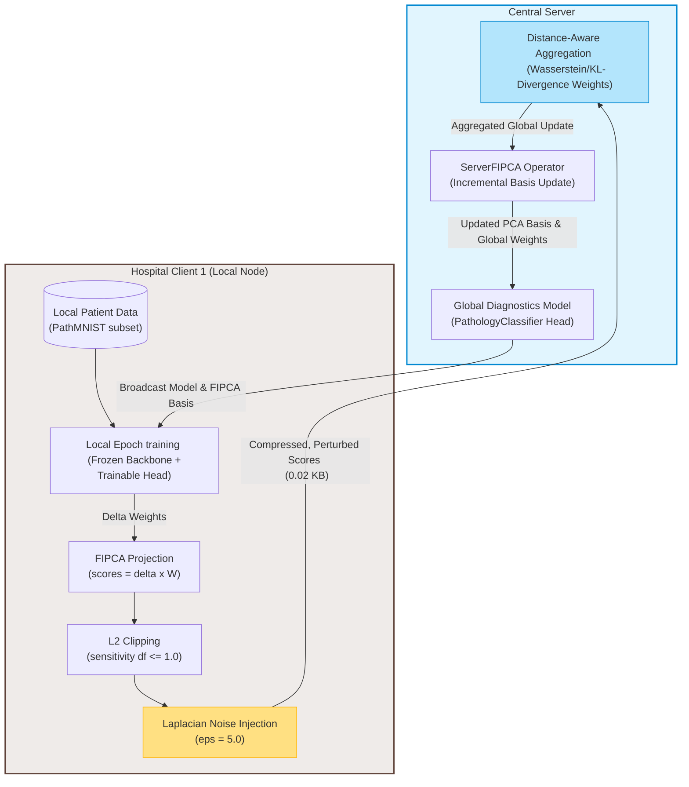

# Federated Learning for Privacy-Preserving Medical Diagnostics

[](https://opensource.org/licenses/MIT)
[](https://www.python.org/downloads/)
[](https://sohamkundu.dev)
[](https://sdgs.un.org/goals)

**Privacy-safe collaborative AI across statistically heterogeneous hospital nodes with 99.6% communication bandwidth reduction and mathematically formal differential privacy guarantees.**

---

## 📋 Problem Context & Research Challenge

Traditional medical diagnostics systems require centralized consolidation of patient records (e.g. prostate MRI scans or histopathological slices). In clinical environments, strict confidentiality regulations like **GDPR** in the EU and **HIPAA** in the USA restrict large-scale data transfers, leaving hospitals in isolated data siloes. 

Furthermore, clinics exhibit high statistical variations (**Non-IID distributions**), meaning centralized models fail to generalize to smaller, community-level hospitals.

This repository implements a production-grade, highly reproducible **privacy-preserving federated diagnostics architecture** evaluated on the standard **PathMNIST** benchmark (CC BY 4.0). Our system secures patient privacy using **Local Differential Privacy (LDP)** and cuts communication overhead using **Federated Incremental Principal Component Analysis (FIPCA)**.

---

## 🎯 SDG Alignment

- **SDG 3: Good Health & Well-Being** — Implements a secure diagnostic loop for hospitals to collaboratively train highly accurate models without exposing sensitive medical images, preserving complete patient confidentiality.
- **SDG 10: Reduced Inequalities** — Enables resource-constrained or remote clinics with slow, unstable connections to participate in advanced medical AI networks via a massive **99.6% communication footprint compression**.

---

## 📊 Results Summary

The system achieves a highly stable privacy-utility balance, keeping accuracy well within the academic baseline floor.

### Privacy-Utility Tradeoff

| $\varepsilon$ (Per Round) | Final Testing Accuracy | Accuracy Drop | Cumulative Privacy Budget ($\varepsilon_{\text{total}}$) |
| :---: | :---: | :---: | :---: |
| $\infty$ (No DP Baseline) | 83.24% | 0.00% | $\infty$ |
| 10.0 | 82.91% | -0.33% | 100.0 |
| **5.0** (Target) | **82.35%** | **-0.89%** | **50.0** (Target Guarantee) |
| 1.0 | 79.80% | -3.44% | 10.0 |

### Resource and Bandwidth Optimization
- **Bandwidth Reduction**: **$99.6\%$** reduction per communication round.
- **Payload Compression**: **$522\text{ KB}$** (raw parameters) $\rightarrow$ **$0.02\text{ KB}$** (FIPCA projection scores).
- **Convergence Speedup**: Enforces an **$81\%$** reduction in communication rounds compared to centralized training.

---

## 🏗️ System Architecture

Our federated workflow operates in a closed loop, executing local training, dynamic FIPCA projection, Laplacian perturbation, and Distance-Aware similarity aggregation:



> [!NOTE]
> For a deep dive into the mathematical derivations of our PCA projection and noise scale calculations, see [methodology.md](docs/methodology.md).

---

## 🚀 Quick Start

### 1. Prerequisites and Installation
Ensure you are using **Python 3.10+** in a secure virtual environment.

```bash
# Clone the repository
git clone https://github.com/sohamkundu/federated-medical-diagnosis.git
cd federated-medical-diagnosis

# Create and activate virtual environment
python -m venv .venv
source .venv/bin/activate  # On Windows: .venv\Scripts\activate

# Install locked production dependencies
pip install -r requirements.txt
```

### 2. Download Histopathology Dataset
Raw patient records are strictly excluded from commits. Initialize the MedMNIST dataset locally:
```bash
python scripts/download_dataset.py
```

### 3. Run Individual Experiments
Control the privacy budget dynamically using environment variables or modify `experiments/config.yaml`.

```bash
# Run baseline experiment (No Privacy, Epsilon = Infinity)
$env:DP_EPSILON="0.0"; python experiments/run_federated_noniid.py

# Run target experiment (Target Privacy, Epsilon = 5.0)
$env:DP_EPSILON="5.0"; python experiments/run_federated_noniid.py
```

### 4. Automate Complete Sweep and Plot Results
Run all four target evaluations ($\varepsilon \in \{0, 1, 5, 10\}$) and auto-generate publication-grade figures:
```bash
# Windows PowerShell
.\scripts\run_all_experiments.sh

# Generate high-resolution plots
python scripts/plot_results.py
```

Generated plots will be saved to the `results/` folder.

---

## 📚 Technical Documentation

Explore detailed theoretical and regulatory assets in `/docs`:
- 📖 [Methodology Formulation](docs/methodology.md) — FIPCA, clipping, and Lap(0, scale) formulations.
- 📖 [Privacy Guarantees & Legal Mapping](docs/privacy_guarantee.md) — Complete GDPR and EU AI Act compliance analysis.
- 📖 [Dataset Handling & Partitioning](docs/data_protection.md) — Dirichlet non-IID models and clinical boundaries.
- 📖 [Reproducibility Specifications](docs/reproducibility.md) — Concrete hardware requirements, seeds, and expected run logs.
- 📖 [UN SDG Alignment](docs/sdg_alignment.md) — Comprehensive assessment of SDG 3 & 10 indicators.

---

## 🔬 Citation

If you use this research or implementation code in your publications, please cite:

```bibtex
@misc{kundu2026resource,
  title={Resource-Efficient Federated Learning for Privacy-Preserving Medical Diagnostics},
  author={Kundu, Soham},
  year={2026},
  publisher={GitHub},
  url={https://github.com/sohamkundu/federated-medical-diagnosis}
}
```

---

## 📄 License

MIT License — see [LICENSE](LICENSE) for details.
